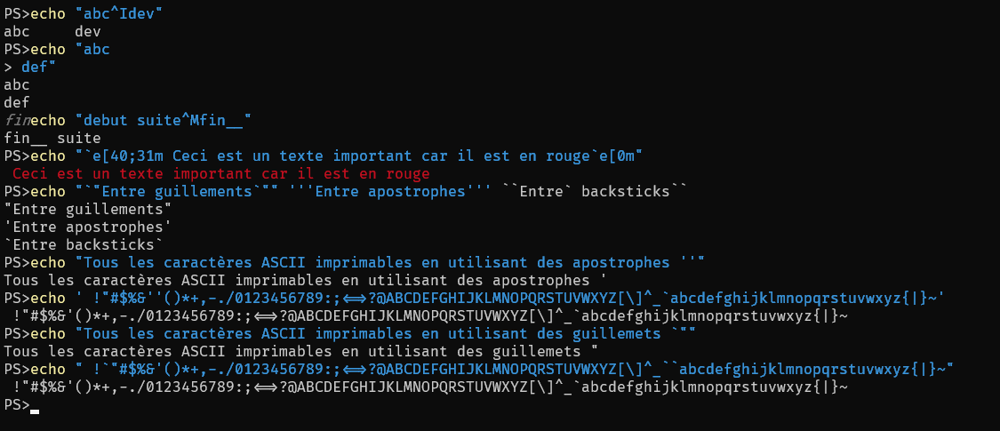

# Codage ASCII

## Définition

- American Standard Code for Information Interchange
- Norme informatique de codage de caractères la plus influente à ce jour.
- Définit 128 caractères sur 7 bits numérotés de 0 à 127, dont 33 codes (de 0 à 31 + 127) et 95 caractères imprimables.
- Norme actuelle : ANSI X3.4:1986

## Caractéristiques

- Ajouter `32 (+2^5)` pour mettre une lettre majuscule en minuscule
- Retirer `32 (-2^5)` pour mettre une lettre minuscule en majuscule
- Codes
  - `espace=32 (0x20)`
  - `0=48 (0x30)`
  - `A=65 (0x41)`
- Observer l'ordre ASCII : `!"#$` sont très bien placés

## Table

| **Nombre** | **Description** | **Min-Max Hex** | **Caractères**               |
| ---------- | --------------- | --------------- | ---------------------------- |
| 32         | codes           | `000-031 00-1F` |                              |
| 16         | ponctuation     | `032-047 20-2F` | `!"#$%&'()*+,-./`            |
| 10         | chiffres        | `048-057 30-3A` | `0123456789`                 |
| 07         | ponctuation     | `058-064 3B-40` | `:;<=>?@`                    |
| 26         | majuscules      | `065-090 41-5A` | `ABCDEFGHIJKLMNOPQRSTUVWXYZ` |
| 06         | ponctuation     | `091-096 5B-60` | `` [\]^_`  ``                |
| 26         | minucsules      | `097-122 61-7A` | `abcdefghijklmnopqrstuvwxyz` |
| 04         | ponctuation     | `123-126 7B-7E` | `{\|}~`                      |
| 01         | code DEL        | `127 ___ 7F`    | |

## Caractères imprimables codes 32-126 0x20-0x7E

```plaintext
      0123456789ABCDEF
      ----------------
2x  |  !"#$%&'()*+,-./
3x  | 0123456789:;<=>?
4x  | @ABCDEFGHIJKLMNO
5x  | PQRSTUVWXYZ[\]^_
6x  | `abcdefghijklmno
7x  | pqrstuvwxyz{|}~
```

## Quelques codes à connaître

```plaintext
    \t 09 09  TAB  TABULATION       Tabulation
    \n 10 0A   LF  LINE FEED        Saut de ligne : ligne suivante
    \r 13 0D   CR  CARRIAGE RETURN  Retour chariot : retour colonne 0
```

## Autres codes existants

```plaintext
    \0 00 00  NUL  NULL             Nul : fin d'une chaîne
    \a 07 07  BEL  BELL             Cloche : Produit un signal sonore
                                     a = alerte
    \b 08 08   BS  BACKSPACE        Retour arrière :
                                      déplace le curseur à gauche,
                                      efface le caractère
    \v 11 0B   VT  VERTICAL TAB     Tabulation verticale.
    \f 12 0C   FF  FORM FEED        Nouvelle page
    \e 27 1B  ESC  ESCAPE           Caractèrre d'échappement. 
                                    Les octets suivants 
                                    ne sont plus de l’ASCII.
    \\                              Littéralement un \
```

## ASCII dans powershell

```powershell
# Powershell
echo Ctrl+C                    # C=03 interrompt le programme
# activer le son et le volume
echo Ctrl+G                    # G=07 bell
# désactiver le son et le volume
echo abc Ctrl+H Ctrl+H Ctrl+H   # H=08 backspace
echo "abc Ctrl+I def"           # I=09 tabulation 
echo "abc Ctrl+J def"           # J=0A 10 LF
echo "debut suite Ctrl+M fin__" # M=0D 13 CR
#  `e ESCape avec un code couleur
echo "`e[40;31m Ceci est un texte important car il est en rouge`e[0m"
echo "`"Entre guillements`"" '''Entre apostrophes''' ``Entre` backsticks`` 
echo "Tous les caractères ASCII imprimables en utilisant des apostrophes '" 
echo ' !"#$%&''()*+,-./0123456789:;<=>?@ABCDEFGHIJKLMNOPQRSTUVWXYZ[\]^_`abcdefghijklmnopqrstuvwxyz{|}~'
echo "Tous les caractères ASCII imprimables en utilisant des guillemets `""
echo " !`"#$%&'()*+,-./0123456789:;<=>?@ABCDEFGHIJKLMNOPQRSTUVWXYZ[\]^_``abcdefghijklmnopqrstuvwxyz{|}~"
```



Voir aussi [win10colors.cmd en ligne](https://gist.github.com/mlocati/fdabcaeb8071d5c75a2d51712db24011#file-win10colors-cmd) / [win10colors.cmd local](win10colors.cmd)

## ASCII dans linux bash

```bash
# Linux bash
# activer le son et le volume
echo -e "\a"
# désactiver le son et le volume
echo -e "abc\bd"
echo -e "abc\td"
echo -e "\e[40;31m Ceci est un texte important car il est en rouge\e[0m" # Codes de 30 à 37 et de 40 à 47
echo -e 'debut suite Ctrl+M fin__'
echo "\"Entre guillements\"" \''Entre apostrophes !!!'\' \`Entre\ backsticks\` 
echo "Tous les caractères ASCII imprimables en utilisant des apostrophes '" 
echo ' !"#$%&'\''\()*+,-./0123456789:;<=>?@ABCDEFGHIJKLMNOPQRSTUVWXYZ[\]^_`abcdefghijklmnopqrstuvwxyz{|}~'
echo ' !"'"#$%&'\()*+,-./0123456789:;<=>?@ABCDEFGHIJKLMNOPQRSTUVWXYZ[\]^_\`abcdefghijklmnopqrstuvwxyz{|}~"
```


## Description étendu des codes ASCII

[Source](https://www.purebasic.com/french/documentation/reference/ascii.html)

| **Dec** | **Hex** | **Symbol** | **Description : Signification**                                                                                                                                                                                                                               |
| ------- | ------- | ---------- | ------------------------------------------------------------------------------------------------------------------------------------------------------------------------------------------------------------------------------------------------------------- |
| 0       | 00      | NUL        | (NULL) : caractère nul.<br>Typiquement  utilisé pour indiquer la fin d'une chaîne.                                                                                                                                                   |
| 1       | 01      | SOH        | (Start Of Heading) : début de titre<br>Indique le début d'un bloc de données, ou la zone d'en-tête d'un bloc de données.                                                                                                                                      |
| 2       | 02      | STX        | (Start of TeXt) : début de texte<br>Typiquement envoyé comme premier caractère dans un bloc de texte, pendant les communications.                                                                                                                             |
| 3       | 03      | ETX        | (End of TeXt) : fin de texte<br>Typiquement envoyé comme dernier caractère dans un bloc de texte, pendant les communications.                                                                                                                                 |
| 4       | 04      | EOT        | (End Of Transmission) : fin de transmission<br>Utilisé pour indiquer la fin d'une transmission.                                                                                                                                                               |
| 5       | 05      | ENQ        | (ENQuiry) : requête - invitation à la transmission<br>Envoyé à un récepteur afin d'obtenir une réponse.                                                                                                                                                       |
| 6       | 06      | ACK        | (ACKnowledge) : accusé de réception<br>Envoyé par un récepteur pour indiquer qu'il a reçu et/ou compris la requête.                                                                                                                                           |
| 7       | 07      | BEL        | (BELL) : cloche<br>Produit un signal sonore (provoque l'émission d'un 'bip' par le haut-parleur du PC)                                                                                                                                                        |
| 8       | 08      | BS         | (BackSpace) : retour arrière<br>Déplace le curseur d'une position vers la gauche (pourrait également effacer le caractère à gauche du curseur avant d'effectuer le mouvement)                                                                                 |
| 9       | 09      | HT         | (Horizontal Tab) : tabulation horizontale<br>Typiquement utilisé pour la mise en forme de tableaux dans un texte.                                                                                                                                             |
| 10      | 0A      | LF         | (LineFeed) : saut de ligne<br>Le caractère utilisé pour représenter l'action de passer une ligne sur une machine à écrire ou une imprimante en mode texte. Typiquement utilisé comme, ou partie des, caractères de fin de ligne.                              |
| 11      | 0B      | VT         | (Vertical Tab) : tabulation verticale<br>Même chose que (horizontale), mais le déplacement s'effectue d'une rangée vers le bas au lieu d'une colonne vers la droite.tabulationla                                                                              |
| 12      | 0C      | FF         | (Form Feed) : saut de page<br>Caractère typiquement utilisé pour indiquer à une imprimante (en mode texte) de passer à la page (feuille) suivante.                                                                                                            |
| 13      | 0D      | CR         | (Carriage Return) : retour chariot<br>Le caractère qui représente l'action de ramener la tête d'une machine à écrire ou d'une imprimante au début de la ligne. Typiquement utilisé comme, ou partie des, caractères de fin de ligne.                          |
| 14      | 0E      | SO         | (Shift Out) : mouvement sortant<br>Début d'un bloc de caractères dont la signification dépend de l'implémentation.                                                                                                                                            |
| 15      | 0F      | SI         | (Shift In) : mouvement entrant<br>Ferme la transmission du type de bloc ci-dessus.                                                                                                                                                                            |
| 16      | 10      | DLE        | (Data Link Escape) : échappement de lien de donnée<br>Utilisé pour indiquer que le caractère de contrôle suivant devrait être interprété comme donnée et non comme caractère de contrôle.                                                                     |
| 17      | 11      | DC1        | (Device Control 1) : contrôle de périphérique 1<br>Typiquement utilisé pour activer une partie d'un équipement. L'usage le plus courant aujourd'hui est en tant que caractère XON dans les communications série à contrôle de flux logiciel.                  |
| 18      | 12      | DC2        | (Device Control 2) : contrôle de périphérique 2<br>Un autre caractère de contrôle de périphérique. Son usage dépend du contexte.                                                                                                                              |
| 19      | 13      | DC3        | (Device Control 3) : contrôle de périphérique 3<br>Typiquement utilisé pour désactiver une partie d'un équipement. L'usage le plus courant aujourd'hui est en tant que caractère XOFF dans les communications série à contrôle de flux logiciel.              |
| 20      | 14      | DC4        | (Device Control 4) : contrôle de périphérique 4<br>Un autre caractère de contrôle de périphérique.                                                                                                                                                            |
| 21      | 15      | NAK        | (Negative AcKnowledge) : accusé de réception négatif<br>Typiquement utilisé pour signaler des données non-reçues ou non-comprises (erronée).                                                                                                                  |
| 22      | 16      | SYN        | (SYNchronous idle) : attente synchronisée<br>Comme son nom l'indique, il s'agit d'un signal envoyé à intervalle régulier pour indiquer que le canal de communication est en attente, mais toujours actif.                                                     |
| 23      | 17      | ETB        | (End of Transmission Block) : fin de transmission de bloc<br>Utilisé pour contrôler la transmission de donnée en indiquant la fin de bloc. A ne pas confondre avec EOT.                                                                                       |
| 24      | 18      | CAN        | (CANcel) : annulation<br>Signifie généralement que la donnée envoyée précédemment devrait être ignorée, bien que les détails dépendent de l'application.                                                                                                      |
| 25      | 19      | EM         | (End of Medium) : fin de média<br>Utilisé pour indiquer la fin d'un média, par exemple la fin d'un lecteur de bande                                                                                                                                           |
| 26      | 1A      | SUB        | (SUBstitute) : substitution<br>Un caractère utilisé pour indiquer qu'un caractère a été substitué.                                                                                                                                                            |
| 27      | 1B      | ESC        | (ESCape) : échappement<br>Le caractère produit habituellement en appuyant sur la touche 'ECHAP' de votre clavier, utilisé dans les "séquences d'échappement" pour fournir des informations de formattage aux afficheurs de texte (consoles, imprimantes, etc.) |
| 28      | 1C      | FS         | (File Separator) : séparateur de fichier                                                                                                                                                                                                                      |
| 29      | 1D      | 21         | GS (Group Separator) : séparateur de groupe                                                                                                                                                                                                                   |
| 30      | 1E      | RS         | (Record separator) : séparateur d'enregistrement                                                                                                                                                                                                              |
| 31      | 1F      | US         | (Unit separator) : séparateur d'unité                                                                                                                                                                                                                         |

## Raccourcis avec la touche Ctrl

```powershell
# Raccourcis testés avec PowerShell
# Devraient fonctionner dans bash

# Ctrl + S XOFF met le programme en pause
# Ctrl + Q XON  met fin à la pause

# Ctrl + A Sélectionner tout
# Ctrl + C Interrompre programme ou Copier
# Ctrl + L Efface l'écran
# Ctrl + R PS-Readline Recherche dans l'historique des commandes (en arrière)
# Ctrl + S PS-Readline Recherche dans l'historique des commandes (en avant)
# Ctrl + V Coller
# Ctrl + W PS-Readline Supprimer un mot
# Ctrl + X PS-Readline Couper la sélection
# Ctrl + Y PS-Readline Redo
# Ctrl + Z PS-Readline Undo
```

## Codes ASCII via Unicode ou avec Ctrl

```powershell
#  ^  notation caret, remplace la touche Ctrl
#  `0 le backstick ` est le caractère d'échappement en PowerShell
#  `e caractère escape  
# envoie ou affiche des caractères ascii
echo "`0^B^D^E^F^G^I^J^K^M^N^O ^P ^Q ^T ^U `e ^_" | Format-Hex
#      0 2 4 5 6 7 9 A B D E F 10 11 14 15 1B 1F

# sans PS-ReadLine et avec un clavier anglais
echo "^L ^R ^W ^X ^Y ^Z ^[ ^\ ^]" | Format-Hex
       C 12 17 18 19 1A 1B 1C 1D
       
# manquants
#     ^A ^C ^H ^S ^V ^^ ^?
#     01 03 08 13 16 1E DEL   
echo "`u{0001}`u{0003}`u{0008}`u{0013}`u{0016}`u{001E} `u{007F}" | Format-Hex
echo "`u{00}`u{01}`u{02}`u{03}`u{04}`u{05}`u{06}`u{07}`u{08}`u{09}`u{0A}`u{0B}`u{0C}`u{0D}`u{0E}`u{0F}" | Format-Hex
echo "`u{10}`u{11}`u{12}`u{13}`u{14}`u{15}`u{16}`u{17}`u{18}`u{19}`u{1A}`u{1B}`u{1C}`u{1D}`u{1E}`u{1F}" | Format-Hex
```


```bash
echo -e '\u01\u00\u03\u02\u05\u04\u07\u06\u09\u08\u0B\u0A\u0D\u0C\u0F\u0E' | hexdump
echo -e '\u11\u10\u13\u12\u15\u14\u17\u16\u19\u18\u1B\u1A\u1D\u1C\u1F\u1E'
hexdump
```


## Source

[ascii-code.com (en)](https://www.ascii-code.com/) / [(fr)](https://www.ascii-code.com/fr)

[Wikipedia ASCII (en)](https://fr.wikipedia.org/wiki/American_Standard_Code_for_Information_Interchange) / [(fr)](https://fr.wikipedia.org/wiki/American_Standard_Code_for_Information_Interchange)

[Wikipedia Notation Caret (en)](https://en.wikipedia.org/wiki/Caret_notation) / [(fr)](https://fr.wikipedia.org/wiki/Notation_caret)

[Linux readline](https://www.man7.org/linux/man-pages/man3/readline.3.html) / [PS-Readline](https://github.com/PowerShell/PSReadLine)
