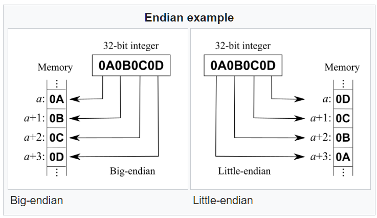
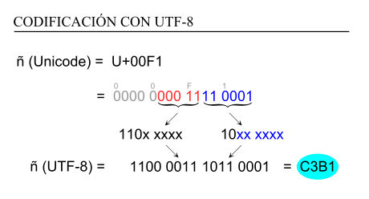
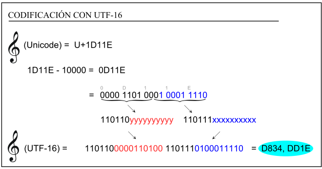
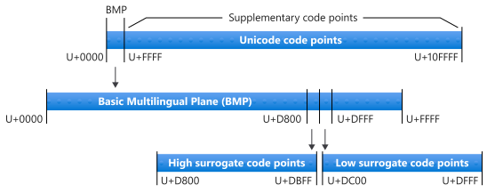
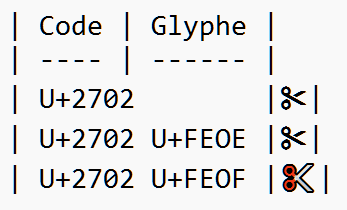

# Unicode

Unicode est un standard informatique qui permet des échanges de textes dans différentes langues, à un niveau mondial. Il est développé par le Consortium Unicode, qui vise au codage de texte écrit en donnant à tout caractère de n'importe quel système d'écriture un nom et un identifiant numérique, et ce de manière unifiée, quels que soient la plateforme informatique ou le logiciel utilisé.

- Première publication : octobre 1991
- Unicode 16.0.0, publiée le 10 septembre 2024.

Unicode a été développé dans le but de remplacer l'utilisation de pages de code nationales.

## Unicode et ISO/CEI 10646

La norme ISO/CEI 10646 définit le même jeu de caractères qu'Unicode.

Unicode définit les points suivants :

- Codage des caractères
- Texte bidirectionnel (gauche à droite, droite à gauche)
- Traitement des points de code non assignés
- Algorithmes : normalisation, comparaisons, tri, recherche...
- Gestion de la casse : majuscules et minuscules

## Définitions

### Point d'entrée Unicode (Code Point)

- Valeur dans l'espace de codage Unicode, nombre entre 0 et 10FFFF (base 16).
- _Type de point d'entrée_ : une des sept classes fondamentales de points de code de la norme : Graphique, Format, Contrôle, Usage privé, Substitut, Non-caractère, Réservé.

### Caractère

1. _Caractère abstrait_ : unité d'information utilisée pour l'organisation, le contrôle ou la représentation de données textuelles.
2. Le plus petit composant du langage écrit qui a une valeur sémantique ; se réfère à la signification et/ou à la forme abstraite, plutôt qu'à une forme spécifique (voir aussi glyphe), bien que dans les tables de codes, une certaine forme de représentation visuelle soit essentielle pour la compréhension du lecteur.
3. L'unité de base du codage des caractères Unicode.

### Classe de Caractère

Un ensemble de caractères qui partages un jeu de propriétés communes. De nombreuses classes de caractère sont définies : Symbole, Ponctuation, Lettre, Chiffre, Mirroir (parenthèse ouvrante et fermante), liaisons, …

### Charset

- `charset` = `Coded Character Set`
- `Character Set`, jeu de caractères, ensemble caractères utilisés pour représenter des données textuelles
- `Coded Character Set` : un code a été attribué à chaque caractère
- `Code Page`: synonyme de `Coded Character Set`

### Système d’écriture

Deux définitions. La manière dont une langue s’écrit, par exemple en utilisant un alphabet et le système d’écriture particulier d’une langue. Le Japon utilise actuellement quatre systèmes d’écriture. Unicode a recensé six grandes familles de systèmes d’écritures.

### Glyphe

1. Dessin particulier d'un caractère dans une certaine police.
2. Forme abstraite qui représente cette image
3. _Glyph Code_ : code numérique qui fait référence à un glyphe.

### Graphème

1. Une unité d'écriture minimalement distinctive dans le contexte d'un système d'écriture particulier.
2. Ce que l'utilisateur perçoit comme un caractère

### Police de caractères / police d’écriture / fonte

- Une collection de glyphes utilisée pour la représentation visuelle des caractères.
- Une police est souvent associée à un ensemble de paramètres (la taille, la posture, le poids et l'empattement)
- Garamond est une police de caractères ; le Garamond romain gras 12 points est une fonte.

[Liste des termes Unicode](https://www.unicode.org/glossary/)

### Texte brut

Texte codé par ordinateur qui consiste uniquement en une séquence de points de code d'une norme donnée, sans autre information de formatage ou de structure. L'échange de texte brut est couramment utilisé entre des systèmes informatiques qui ne partagent pas de protocoles de niveau supérieur.

## Plan Unicode

- Gamme de 65 536 (10000 en base 16) points de code Unicode contigus, où le premier point de code est un multiple entier de 65 536 (1000016).
- 17 plans Unicode au total, Plan 0 = `PMB`, Plans 15 et 16 : plans à usage privé, Plan 1 à 14 : autres plans
- `PMB` : Plan Multilingue de Base de `U+0000 à U+FFFF`
- Plans 5 à 14 `U+40000 - U+DFFFF` non utilisés
- Plan 16 `U+F0000 - U+FFFFF`: zone supplémentaire A à usage privé
- Plan 17 `U+100000 - U+10FFFFF`: zone supplémentaire B à usage privé

## UTF (Format de transformation universel (UTF) et Schéma de codage des caractères

Il existe sept schémas de codage des caractères : UTF-8, UTF-16, UTF-16BE, UTF-16LE, UTF-32, UTF-32BE, and UTF-32LE.

- `BOM` = `Byte Order Mark`:
  - Point d'entrée Unicode `FEFF`
  - Sa présence en début de flux texte (fichier ou données réseau) précise :
    - l'ordre des octets (`big-endian`ou `little-endian`)
    - 
    - le fait que le texte soit de l'Unicode, avec un fort de degré de confiance
    - Quel schéma de codage est utilisé
- `UTF-8`
  - 
  - Compatible avec l'`ASCII` (valeurs <= 127) : un code ASCII occupe 1 octet
  - Aucun caractère ne correspond à la plage 128-255. Tout caractère hors ASCII occupe minimum 2 octets.
  - Un point d'entrée Unicode occupe entre 1 et 4 octets
  - Si le `BOM` est présent : 3 octets supplémentaires en début du texte : `0xEF 0xBB 0xBF`

- `UTF-16`

  - 
  - 1 point d'entrée Unicode encodé occupe soit 2 octets soit 4 octets
  - Valeur du `BOM` pour `UTF-16BE` : `0xFE 0xFF`
  - Valeur du `BOM` pour `UTF-16LE` : `0xFF 0xFE` (les octets sont dans l'ordre inverse)
  - Tout point d'entrée dans le `PMB` occupe 2 octets en `UTF-16`
  - Tout point d'entrée en-dehors du `PMB` occupe 4 octets en `UTF-16`
  - La plage `U+D800 - U+DBFF` est réservée pour le premier octet des paires de code `UTF-16` (noté H ci-dessous)
  - La plage `U+DC00 - U+DFFF` est réservée pour le second octet des paires de code `UTF-16` (noté L ci-dessous)
  - Formule pour trouver le point d'entrée unicode : `10000 (base 16) + (H − D80016) × 40016 + (L − DC0016)`
  - 

- `UTF-32`

  - 1 point d'entrée Unicode encodé occupe exactement 4 octets
  - Peu utilisé en pratique
  - Variantes `big-endian` et `little-endian` disponibles

## Quelques caractères particuliers

- `� U+FFFd` : caractère de remplcement en cas de problème d'encodage
- `ZWNJ U+200C` : Zero Width Non Joiner : interdit de fusionner plusieurs entrées Unicode
- `ZWJ U+200D` : Zero Width Joiner : permet de fusionner plusieurs entrées Unicode en un seul grapèhme ; cf. [liste emoji](https://www.unicode.org/Public/emoji/16.0/emoji-zwj-sequences.txt) ; [séquences emoji](https://unicode.org/emoji/charts/emoji-sequences.html)
- `LRM U+200E` : Marque gauche-à-droite
- `RLM U+200F` : Marque droite-à-gauche

## Variantes

- 16 variants dans la plage `U+FE00..U+FE0F`
- 240 variants dans la plage `U+E0100..U+E01EF`.

| Code | Glyphe |
| ---- | ------ |
| U+2702        |✂︎|
| U+2702 U+FEOE |✂︎|
| U+2702 U+FEOF |✂️|

En pratique, cela permet d’avoir par exemple un emoji en noir et blanc qui s’intègre au texte et un autre, coloré, qui ressemble à une icône.

## Liens

- [Tables officielles](http://www.unicode.org/charts/)
- [Informations détaillées](https://www.compart.com/fr/unicode/)
- [Rechercher un caractère, trouver des polices, …](https://www.fileformat.info/info/unicode/)
- [Emoji to text](https://mefody.dev/chunks/emoji-to-text/)
- [Détails sur les émoji](https://tonsky.me/blog/emoji/)

## Exercices

1. Écrire la phrase `Voix ambiguë d’un cœur qui au zéphyr préfère les jattes de kiwis` dans un fichier texte.
2. Enregistrer plusieurs fois ce fichier, avec des encodages différents : windows1252, ISO8859-15, UTF-8, UTF-16BE...
3. Utiliser la commande `cat` ou `type` dans un terminal pour afficher les différents fichiers. Afficher le contenu du fichier selon plusieurs encodages. Utilisez également `hexdump (fichier)` (Linux) ou `Format-Hex (fichier)` (Powershell) pour voir le contenu des fichiers.
4. Dans un autre fichier texte écrire `CAROLINE AUPICK, NÉE DUFAŸS EST LA MÈRE DU POÈTE FRANÇAIS CHARLES BAUDELAIRE. LE PRIX D’UN ŒUF EST DE 0,50 € …`. Essayer de sauvegarder ce fichier au format windows1252, ISO-8859-1 et ISO-8859-15, UTF-8 et d'afficher le contenu de ce fichier. Que deviennent les quatre caractères `Ç Œ Ÿ € …` ?
5. Dans un fichier texte enregistrez la phrase `Les codes A4 A6 A8 B4 B8 BC BD BE diffèrent entre ISO 8859-1 et ISO-8859-15. En voici la preuve : € Š š Ž ž Œ œ Ÿ`. Enregistrez ce fichier avec l'encodage ISO-8859-15. Affichez ce fichier avec ISO-8859-1, ISO-8859-15 et windows-1252.
6. Dans un fichier texte enregistrez la phrase suivante en `windows-1252` : `Les caractères suivants ne sont pas définis dans les deux normes ISO : ‚ ƒ „ … † ‡ ˆ ‰ ‹ ‘ ’ “ ” • – — ˜ ™ ›`. Essayer de sauvegarder ou d'afficher ce fichier en ISO-8859-1 et ISO-8859-15.
